# AR-VR-Meta.ai

## Introduction

Welcome to AR-VR-Meta.ai, an innovative 3D Metaverse that redefines education and social connectivity through virtual interactions and conferences. Our platform offers a comprehensive solution for educational institutions, students, and organizations seeking to enhance learning and social engagement in a virtual environment. AR-VR-Meta.ai fosters seamless connections among users, regardless of geographical distances, offering an unparalleled blend of functionality and immersive experiences.

At the heart of AR-VR-Meta.ai lies its advanced features, including a state-of-the-art LLM-powered chatbot that interacts with users through lifelike speech. This chatbot can parse PDF information and provide real-time assistance, enriching the user experience with personalized support. Additionally, everything within the platform is VR-enabled, with audio chat functionality enhancing communication and collaboration.

One of the standout features of AR-VR-Meta.ai is its Virtual Classroom, which revolutionizes online education by providing an interactive 3D learning environment. Students engage with course materials, assignments, and 3D models alongside virtual avatars and educators. Furthermore, a Homework-Helping LLM-powered chatbot augments the learning process, offering personalized assistance with assignments and course materials.

AR-VR-Meta.ai is more than just a virtual environment; it's a dynamic platform that empowers users to connect, collaborate, and learn in entirely new ways. Join us in exploring the endless possibilities of the digital realm.

## Tech Stack

Our platform leverages a diverse array of technologies to deliver immersive experiences and seamless interactions:

- **Three.js**: A lightweight 3D library used for rendering immersive 3D graphics in web browsers.
- **React**: A JavaScript library for building user interfaces, facilitating the development of dynamic and interactive components.
- **Langchain**: A language model technology utilized for natural language processing and dialogue generation.
- **Python**: A versatile programming language employed for various backend and machine learning tasks.
- **Ether.js**: A JavaScript library for interacting with the Ethereum blockchain, enabling seamless integration of blockchain features.
- **GSAP (GreenSock Animation Platform)**: A powerful animation library for creating fluid and engaging animations in web applications.
- **R3F (React Three Fiber)**: A React renderer for Three.js, enhancing the integration of Three.js with React applications.
- **Gemini AI**: An artificial intelligence technology utilized for various tasks within the platform.
- **LLM (Large Language Model)**: Advanced language model technology employed for natural language processing and conversation capabilities.
- **RAG (Retrieval-Augmented Generation)**: An architecture for conversational AI that combines retrieval-based and generative models.
- **Socket.io**: A JavaScript library for real-time bidirectional communication between clients and servers.
- **Drei**: A collection of useful helpers and abstractions for Three.js, enhancing the development process.
- **Jotai**: A state management library for React applications, simplifying the management of application state.
- **Sepolia**: (Please provide more information if necessary.)
- **Express**: A web application framework for Node.js, used for building RESTful APIs and backend services.
- **Node.js**: A runtime environment for executing JavaScript code outside of a web browser, commonly used for server-side applications.
- **AR.js**: A JavaScript library for building augmented reality (AR) experiences on the web.
- **WebXR**: An API for creating virtual reality (VR) and augmented reality (AR) experiences on the web.
- **FastAPI**: A modern web framework for building APIs with Python, known for its high performance and simplicity.
- **0x0.st**: A file hosting service used for sharing files and resources within the platform.
- **MongoDB**: A NoSQL database used for storing and managing application data.
- **WebRTC**: A web technology for real-time communication between web browsers, facilitating video conferencing and peer-to-peer communication.
- **Peer.js**: A JavaScript library for simplifying WebRTC peer-to-peer data connections.
- **pyttsx3**: A Python library for text-to-speech conversion, enabling speech synthesis within the platform.
- **Remix**: An online integrated development environment (IDE) for Ethereum smart contract development and testing.
- **NFT**: Non-fungible tokens, used for representing ownership of unique digital assets within the platform.
- **VR**: Virtual reality technology, providing immersive 3D environments and experiences.
- **ErsatzTV**: A platform for hosting and streaming virtual theater screenings and cinema experiences.
- **Jellyfin**: A free and open-source media server software, facilitating the hosting and streaming of media content within the platform.

## About the Project

AR-VR-Meta.ai offers a diverse range of functionalities tailored to various use cases:

### VR Presentation Room

The VR Meeting Room offers a professional virtual environment for conducting meetings and presentations. Users can upload PDF presentations and interact with 3D models to showcase prototypes or ideas. Real-time doubt support ensures a smooth meeting experience, while the immersive VR setting provides a sense of presence and engagement.

### Conference Hall

The Conference Hall is designed to accommodate large-scale events and conferences with up to 500 attendees. It features a big screen for sharing information and presentations to all participants simultaneously. Presenters can showcase 3D models for educational purposes, and the entire hall is VR-enabled with audio chat support for seamless communication.

### Virtual Classroom

The Virtual Classroom transforms online education by offering an immersive 3D learning environment. Inspired by the isolation and monotony of online classes during the COVID-19 pandemic, AR-VR-Meta.ai aims to create a more engaging and interactive experience. Students engage with course materials, assignments, and 3D models alongside virtual avatars and educators. A Homework-Helping LLM-powered chatbot augments the learning process, offering personalized assistance with assignments and course materials.

## Features

- Virtual meeting rooms with PDF presentation support and real-time doubt resolution.
- Conference halls for large-scale events with 3D model showcasing and AR compatibility.
- Virtual classrooms with interactive 3D models, assignments, and real-time support.
- LLM-powered chatbots for personalized educational assistance and support.
- VR-enabled environments with audio chat for enhanced communication and collaboration.

## Contributions

We welcome contributions from developers, designers, and creators to enhance the functionality and user experience of AR-VR-Meta.ai. Please refer to our contribution guidelines for more information.

## Images

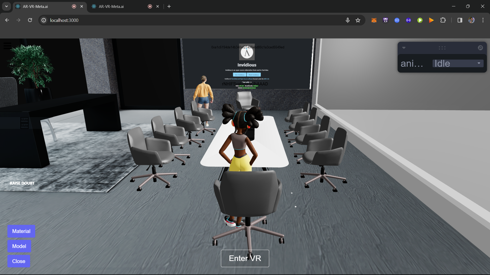

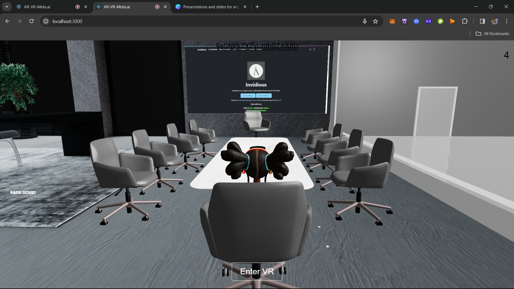

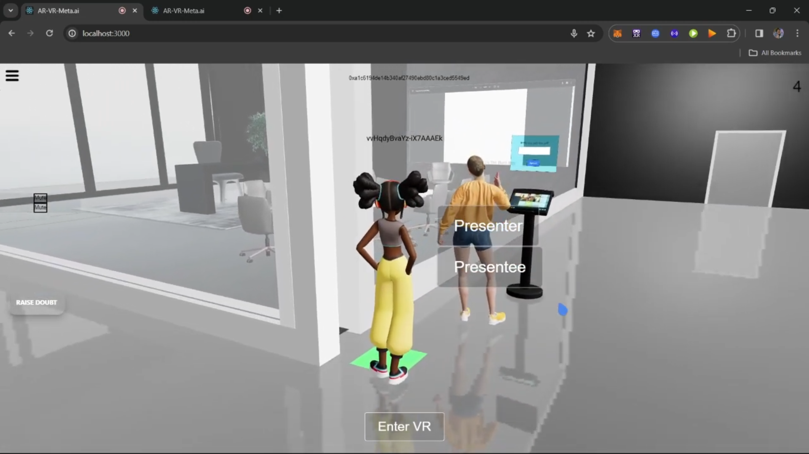

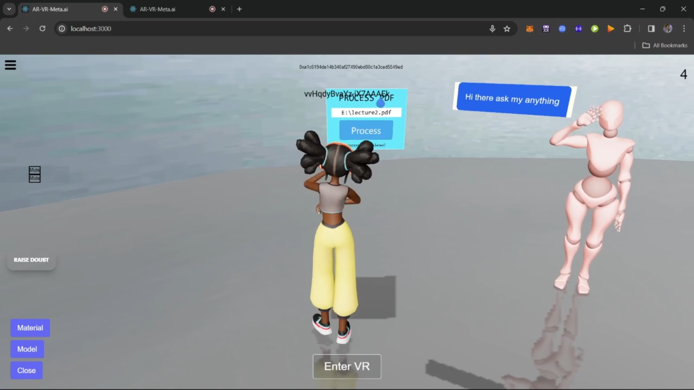

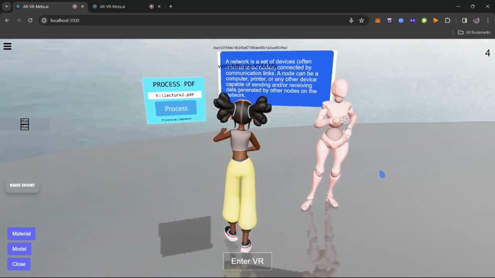

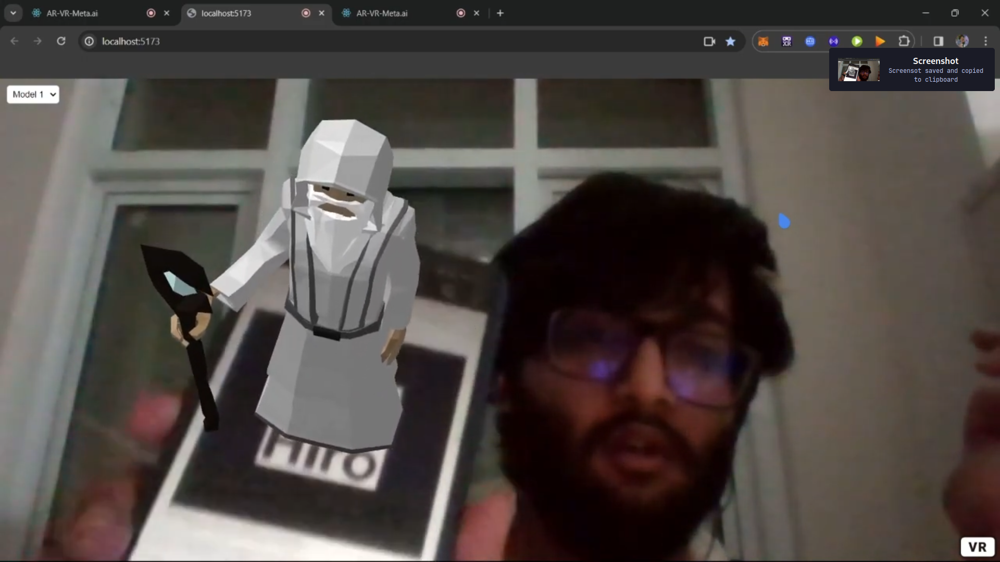

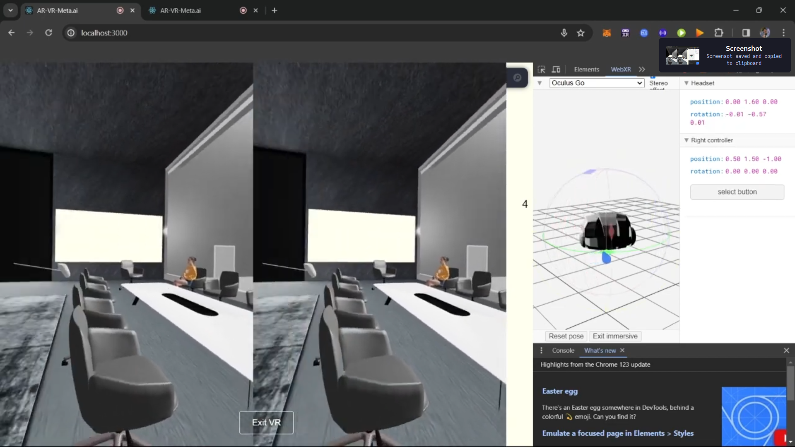

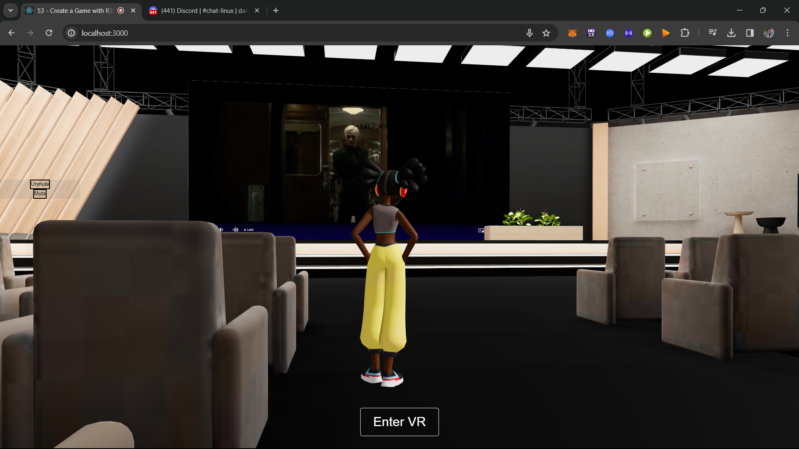

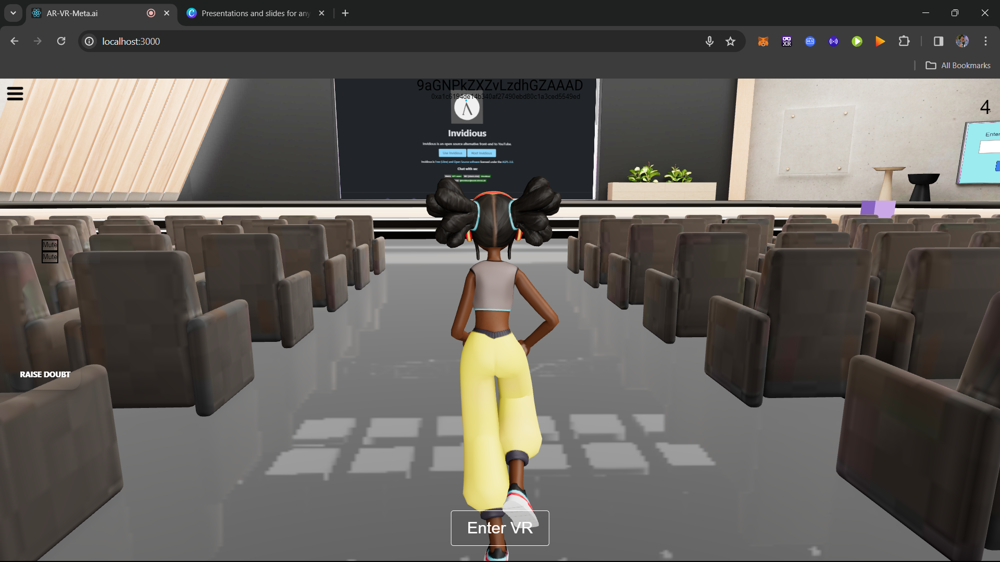

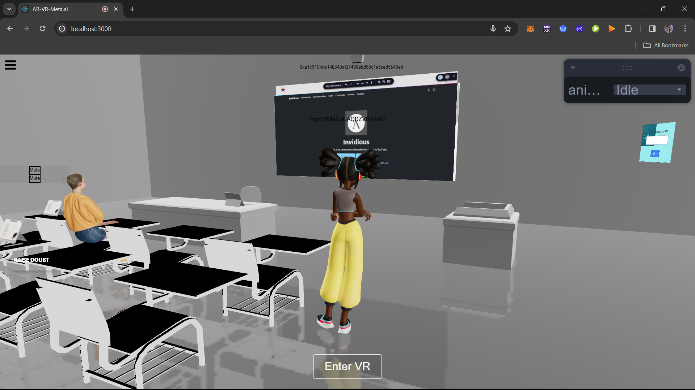

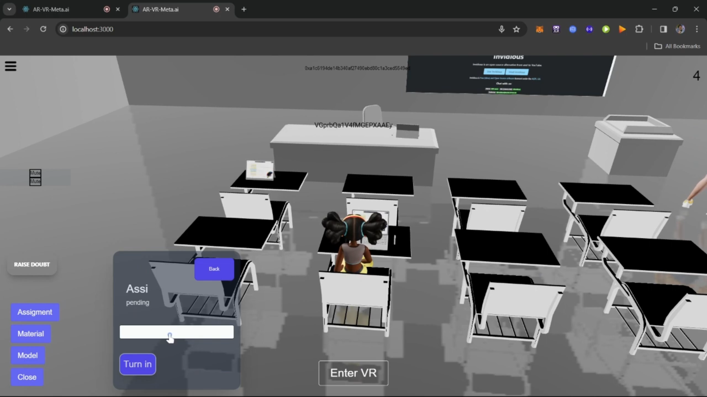

## Video

## How to Run

1. Run the `server.js` in Socket-Server.
2. Run the `app.py` in Langchain-RAG-Server (`python app.py`).
3. Run the `index.js` in the Backend (`nodemon index.js`).
4. For the AR-server, do `npx vite --host` (AR depends on your PC's compatibility).
5. Now, just do `npm run dev` in the main directory.
6. Go to `localhost:3000`, sign up, and enter the metaverse.

## License

AR-VR-Meta.ai is licensed under the MIT License. See the LICENSE file for details.
